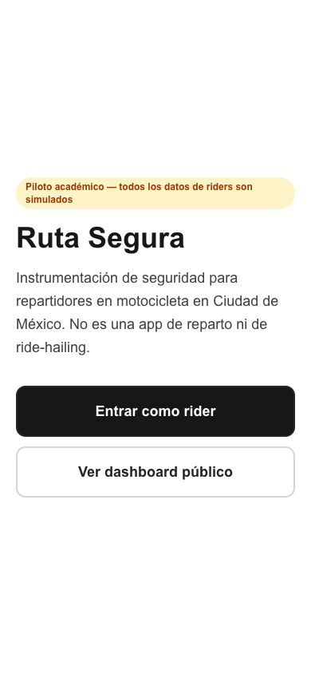
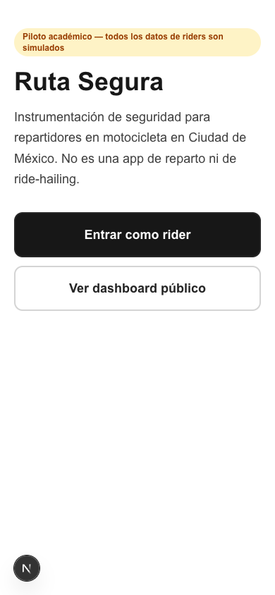
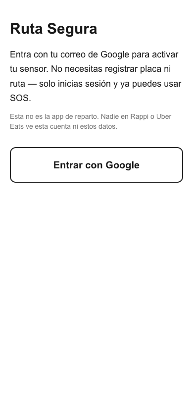
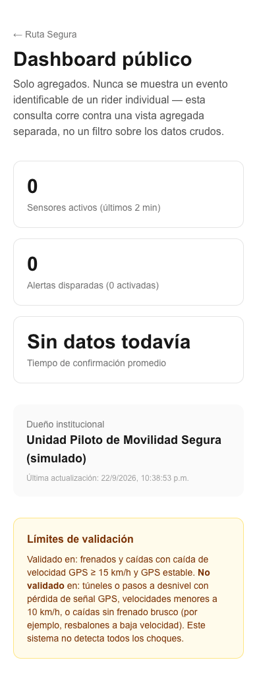

# PERSONA.md — Persona test: Ángel

Persona test de `docs/PACKET.md` §10, Layer 1:

> Ángel, 27, repartidor, batería siempre baja, desconfía de apps con
> registro largo, se rinde en silencio si algo tarda.

## Método

Capturas **reales**, no descripciones de código:

- `/`, `/entrar`, `/dashboard` — Chromium headless (Playwright, viewport
  390×844 simulando teléfono) contra el deploy de producción
  `https://ruta-segura-peach.vercel.app`.
- `/rider`, `/rider/debug` — no se pueden automatizar: requieren una
  sesión real de Google, y este entorno no tiene acceso a un navegador
  con extensión ni a las credenciales del usuario. **Pendiente**: el
  usuario debe tomarlas en su propio navegador ya logueado y agregarlas
  a `docs/persona-screenshots/` (pasos abajo).

Capturas guardadas en `docs/persona-screenshots/`.

## Paso 1 — Landing (`/`)

**Confusión encontrada (la peor del pase):** casi la mitad superior de
la pantalla queda en blanco antes de que aparezca cualquier contenido
— el contenedor centraba verticalmente (`justify-center` sobre
`min-h-screen`). Para Ángel, que abandona cosas ambiguas y no confía
en apps nuevas, una pantalla que abre con medio celular vacío lee como
"se está cargando" o "algo se rompió", justo en el primer contacto con
la app — el peor momento posible para sembrar duda.

**Arreglado:** se quitó `min-h-screen flex-col justify-center`; el
contenido ahora empieza arriba, igual que en `/entrar`, `/rider` y
`/dashboard`.

Verificado con lint + build + captura local después del fix.

## Paso 2 — Login (`/entrar`)

Sin fricción para Ángel: un botón, una frase que responde
directamente su desconfianza ("Esta no es la app de reparto. Nadie en
Rappi o Uber Eats ve esta cuenta ni estos datos."), sin campos de
registro. Cumple el criterio de "menos de un minuto o lo abandona".
Sin confusión encontrada.

## Paso 3 — Dashboard público (`/dashboard`)

No es una pantalla que Ángel usaría en el día a día, pero se probó
como parte del recorrido porque el pie de página de `/rider` enlaza
aquí. Los números en cero son reales (sin actividad de prueba en el
proyecto todavía), no un placeholder hardcodeado — coincide con lo
verificado en el pase mecánico de RLS. Sin confusión encontrada.

## Paso 4 — Sensor + SOS + confianza (`/rider`) — pendiente

Estos tres puntos del persona test requieren sesión autenticada real:

- (a) activar el sensor al iniciar turno
- (b) usar el botón SOS bajo conectividad simulada limitada
- (c) entender qué significa "confianza del sistema: Media"

**Para completarlo:** inicia sesión con tu cuenta en
`https://ruta-segura-peach.vercel.app/rider`, toma capturas de:

1. `/rider` recién cargado (antes de encender el sensor).
2. Después de tocar "Encender sensor".
3. Con la casilla "Simular conectividad limitada" activada, después de
   tocar SOS.
4. `/rider/debug` con al menos un evento en la tabla.

Guárdalas como `docs/persona-screenshots/04-rider-inicial.png`,
`05-rider-sensor.png`, `06-rider-sos-limitada.png`,
`07-rider-debug.png` y avísame — las reviso y completo esta sección
con los hallazgos reales.

## Resumen

| Punto del flujo | Confusión encontrada | Arreglado |
|---|---|---|
| Landing (`/`) | Mitad superior vacía, primer contacto ambiguo | Sí — quitado el centrado vertical |
| Login (`/entrar`) | Ninguna | — |
| Dashboard (`/dashboard`) | Ninguna | — |
| Sensor / SOS / confianza (`/rider`) | Pendiente — requiere sesión real | Pendiente |
