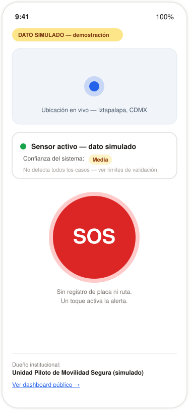
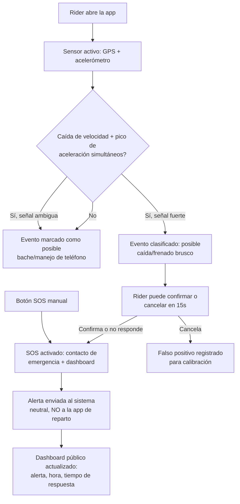
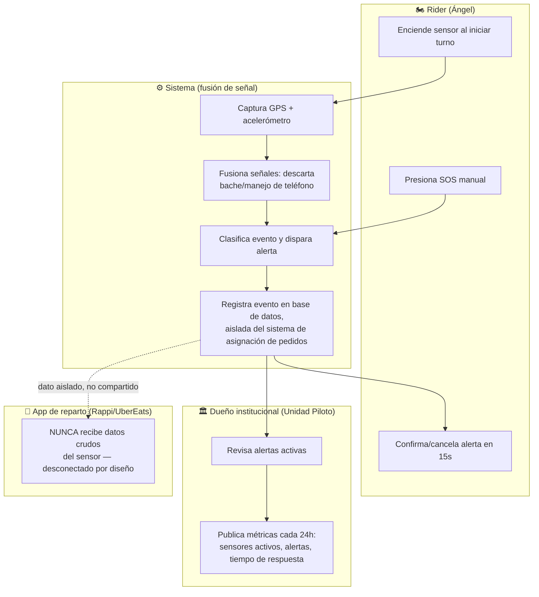

# PACKET.md — The Holy Driver — Role: OPERATOR

**Josep Ferré Gil · Week 7 · Business Bending**

**Vacuum declared (Blueprint):** Vulnerable-User Instrumentation (repartidores en motocicleta)

**Condition honored:** The pilot must be able to launch small, measurable, and operable without waiting for full regulatory resolution. (Operator)

**Non-negotiables inherited from the team:** Shadow Clause (Adversary — named institutional owner + public recurring reporting from day one) and Condition 2 (Technologist — no claiming universal reliability; publish validation limits).

---

## 1. Problem (in my own words)

Delivery riders on motorcycles in Mexico City are the fastest-growing group of road-death victims, and they are completely uninstrumented: no employer-provided safety hardware, no insurer tracking their risk, no neutral system that knows something happened to them when it happens. The technology to detect a fall or a hard brake already sits in their pocket (phone GPS + accelerometer) — nobody has stood it up because the industry is waiting for "enough economic incentive" (an insurance contract, mature actuarial data) before instrumenting the people who need it most. Meanwhile, the one time this city tried a comparable safety pilot — the 2007–2009 panic-button program — it had real funding and still died silently within 21 months because no single job depended on it staying alive.

So the operational problem is not "can we detect a crash" (that's the Technologist's fight) — it's: can a small, real pilot go live in weeks, on riders who already exist, without waiting for a resolved national regulatory framework, and without becoming another buried 2009 panic button?

## 2. Exact user

**Ángel R., 27, repartidor multi-app (Rappi + Uber Eats) en Iztapalapa, CDMX.**

- Trabaja 6–8 horas diarias en motocicleta, sin seguro médico privado.
- Su teléfono es su única herramienta: batería y datos limitados son una restricción real, no una excusa de producto.
- No confía en apps que le piden mucho registro previo — si algo tarda más de un minuto en configurarse, lo abandona.
- Hoy, su "SOS" es informal: comparte ubicación en vivo con un familiar por WhatsApp cuando se siente inseguro (mismo patrón documentado en la Brief de USER).

## 3. Success definition

> "Antes de que cierre el módulo, el sistema debe: (1) detectar eventos de posible caída/frenado brusco combinando GPS (caída de velocidad) + acelerómetro — no acelerómetro solo —, (2) permitir a Ángel activar un botón SOS de un toque, sin registro de placa ni ruta, que funcione con conectividad limitada (fallback SMS), y (3) mostrar un dashboard público, con un dueño institucional nombrado, que se actualice y muestre cuántos sensores están activos, cuántas alertas se dispararon y cuánto tardó la respuesta — honrando la Shadow Clause del equipo."

## 4. Mockup (imagen generada)

Pantalla principal del rider: ubicación en vivo, estado del sensor con nivel de confianza explícito ("Media" — no reclama cobertura universal, honra la Condición 2 del Technologist), botón SOS grande sin registro previo, y pie de página con el dueño institucional del piloto y el enlace al dashboard público — honra directamente la Shadow Clause.

## 5. Flow — Mermaid diagrams

### 5.1 Flujo general (flowchart)

### 5.2 Swimlane — quién hace qué (varios actores)

## 6. Benchmark line

El mejor intento del mundo hoy: **Cambridge Mobile Telematics (DriveWell)** — la capa de fusión de sensores que Uber, Lyft y Grab licencian en vez de construir por su cuenta, porque calibrar esto correctamente es un negocio completo, no una función de sprint.

**Mi versión difiere/localiza porque:** DriveWell vende el patrón de riesgo a aseguradoras dentro de plataformas ya formalizadas y con datos maduros; mi pilotaje es una capa neutral y desconectada de cualquier plataforma de reparto, calibrada explícitamente para motociclistas mexicanos (no ocupantes de auto), y viene con un dueño institucional público desde el día uno — lo que ningún panic-button anterior en esta ciudad tuvo, y lo que causó que el de 2007–2009 muriera en silencio.

## 7. Long-view paragraph (3 sentences)

Si este slice funciona, en tres años se convierte en la capa neutral de datos de seguridad que tanto plataformas de reparto como aseguradoras usan para certificar riesgo, sin que ninguna plataforma sea dueña de los datos crudos del sensor. Cada repartidor acumula un historial de seguridad portátil que lo sigue entre apps, en vez de perderse cada vez que cambia de plataforma. Y los datos etiquetados de caídas y frenados reales — calibrados para motocicletas y calles mexicanas — se vuelven exactamente el dataset de calibración local que cualquier sistema autónomo futuro en esta ciudad también va a necesitar (la posición del Technologist).

## 8. Scope cut — qué NO estoy construyendo

- ❌ Una app de ride-hailing (zona prohibida explícita del brief).
- ❌ El modelo de pago/royalties por conocimiento de ruta (eso es de Money).
- ❌ La app de pasajero de colectivo (eso es de User).
- ❌ Un clasificador de ML entrenado con datos reales de choques — uso fusión por reglas (caída de velocidad GPS + pico de aceleración), etiquetado como "validación en progreso", no una red neuronal.
- ❌ Integración real con una aseguradora o con el gobierno.
- ❌ Datos personales reales de repartidores reales — todo simulado y etiquetado en pantalla.
- ❌ Resolver el 100% de falsos positivos: mi posición de Operator es correr la validación EN PARALELO al piloto, no como compuerta antes de lanzar (disiento parcialmente de Technologist en esto, como está preservado en el Blueprint).

## 9. Arquitectura + Stack

| Capa | Herramienta | Por qué |
|---|---|---|
| Frontend (simulación de app móvil) | Next.js + React + Tailwind | Rápido de desplegar, corre bien como PWA simulando el teléfono del rider |
| Geodata / mapas 🐉 | Leaflet + OpenStreetMap (o Mapbox free tier) | Pieza del Dragon Stack — muestra ubicación y eventos marcados |
| Sensor / telemetría de teléfono 🐉 | Web Geolocation API + DeviceMotion API (fallback: generador de telemetría simulada y etiquetada) | Segunda pieza del Dragon Stack — GPS real del navegador cuando esté disponible, datos sintéticos etiquetados cuando no |
| Motor de fusión (ML/reglas) 🐉 | Función de reglas: Δvelocidad (GPS) + pico de aceleración simultáneos, umbral calibrado contra el hallazgo de Technologist (79.2% falsos positivos con umbral ingenuo) | Tercera pieza del Dragon Stack — "ML" en sentido amplio: lógica de fusión de señal, no accelerómetro solo |
| Backend / base de datos | Supabase (Postgres) | Auth + Row Level Security nativos |
| Auth | Supabase Auth — Sign in with Google | Requisito de la Security Floor |
| Dashboard público | Ruta separada, sin auth, solo lectura agregada (sin PII) | Honra la Shadow Clause: reporte público y recurrente |
| Hosting | Vercel | Stack gratuito, 2 deploys mínimo |

**Row Level Security:** cada rider solo ve sus propios eventos; el dashboard público solo consulta una tabla agregada sin identificadores personales — nunca la tabla cruda de eventos por rider.

## 10. Test plan

**Mechanical pass:**

1. Simular 50 eventos etiquetados (caída real, bache, manejo de teléfono, frenado normal) y correr el motor de fusión — comparar tasa de falsos positivos contra el umbral ingenuo de 0.4g del Technologist (meta: reducirla sustancialmente, documentar el número real obtenido, sin prometer "resuelto").
2. Probar el flujo SOS de punta a punta: botón manual → alerta → dashboard actualizado.
3. Probar RLS: el usuario A no puede leer eventos del usuario B vía API directa.
4. Verificar que el dashboard público nunca expone datos identificables de un rider individual.
5. Encontrar al menos un bug real, arreglarlo, redesplegar (requisito de la rúbrica).

**Persona test (Layer 1):**

- Persona: "Ángel, 27, repartidor, batería siempre baja, desconfía de apps con registro largo, se rinde en silencio si algo tarda."
- Caminar las capturas de pantalla en orden simulando su intento de: (a) activar el sensor al iniciar turno, (b) usar el botón SOS bajo conectividad simulada limitada, (c) entender qué significa "confianza del sistema: Media".
- Registrar cada punto de confusión; arreglar el peor antes de la entrega.

Figuras y benchmarks citados vienen de los Briefs individuales de Week 7 (Operator, Technologist, Adversary, User, Money) y del Blueprint del equipo — no se generaron nuevos números en este packet.
